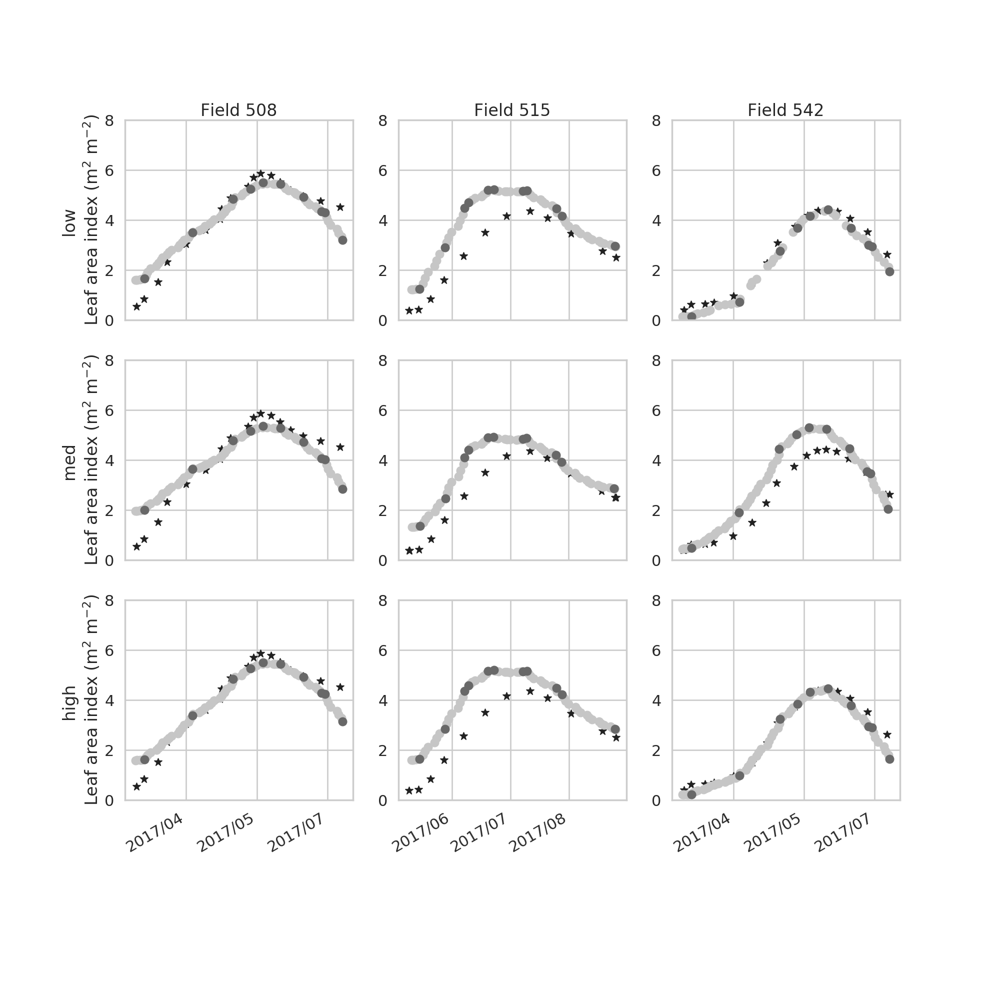
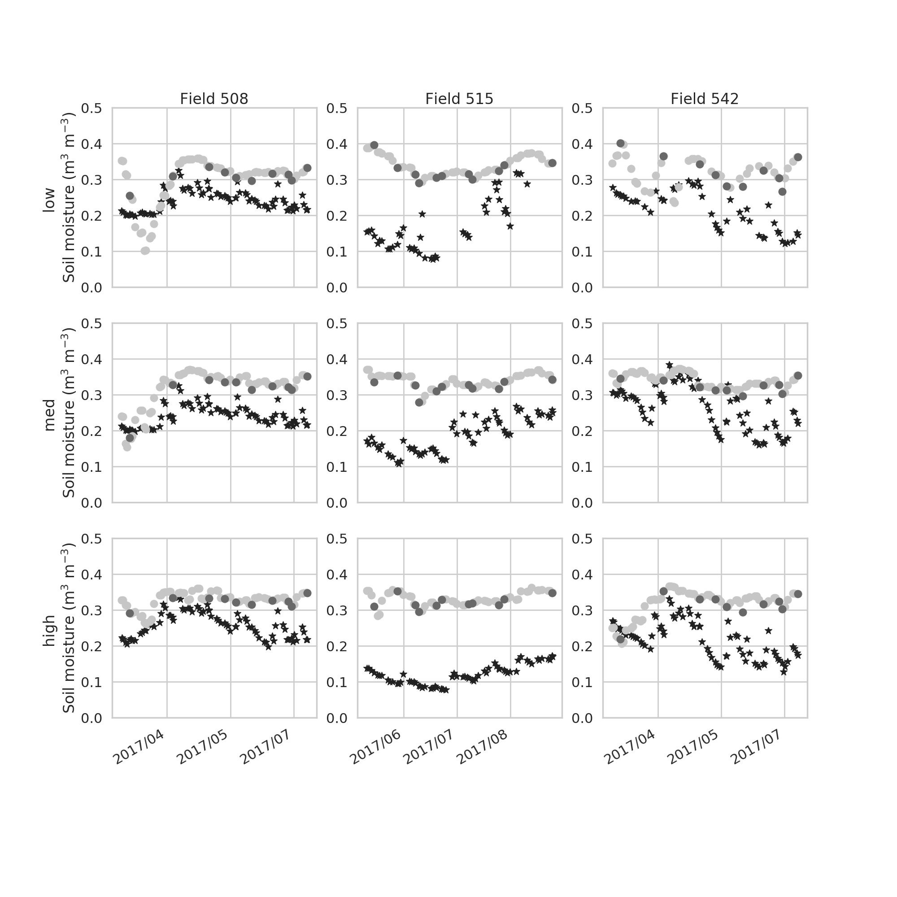
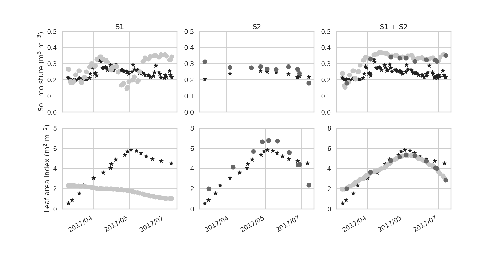
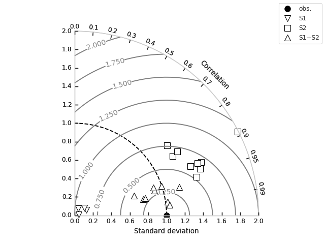
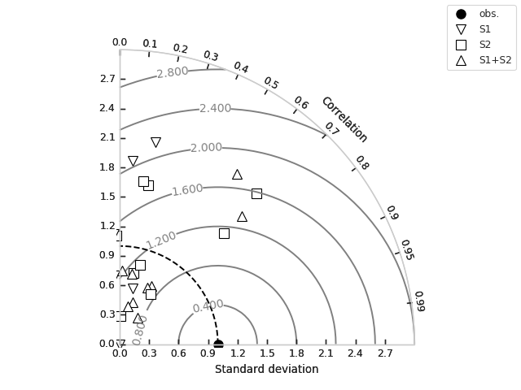

# READ ME

This project is used to run multiple configurations on the S3 retrieval tool using batch submission (bsub) on a cluster.

In order to run the experiments found in the S3 paper over the Munich test sites, the following steps are followed:

    1. import `run_retr_new` and run the `write_paper_exps()` function. This will produce a set of bash scripts for batch
    submission under the exps_run folder.
    2. Submit each bash script to the job queue using the `bsub *.bash` command.
    3. Once the experiments have run timeseries and Taylor diagram figures can be generated by importing the plot_ret
    code and running the `plot_lai()`, `plot_sm()`, `plot_s1s2()` and `plot_taylor_diagram()` functions.

### There are directory paths in run_retr_new and plot_ret that will need to be updated when running on a different
### system or from a different location!!

